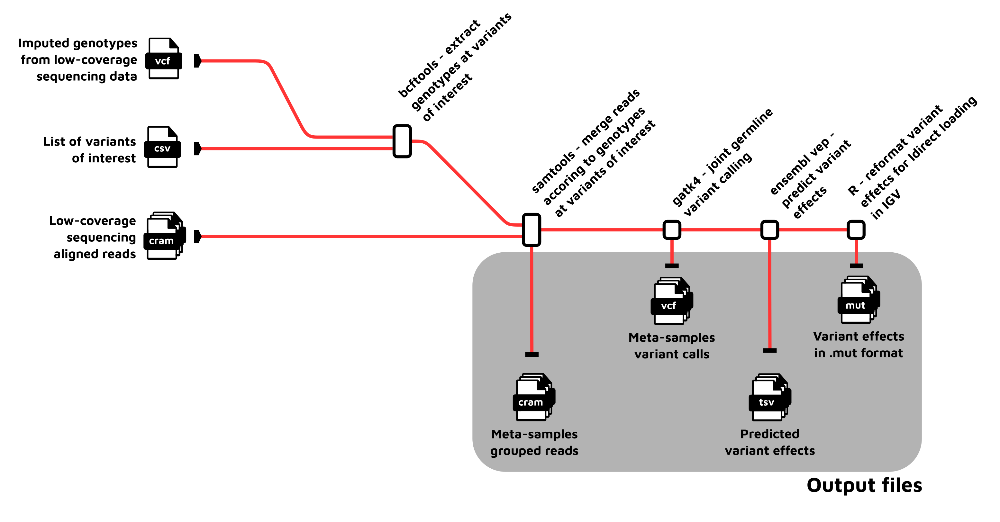

#  

[](https://www.nextflow.io/)
[](https://docs.conda.io/en/latest/)
[](https://www.docker.com/)
[](https://sylabs.io/docs/)

## Introduction

**birneylab/varexplore** is a bioinformatics pipeline that clusters next-generation sequencing data from a set of samples according to the allele that they carry at a given marker, and then calls genetic variants and predicts variant effects on the aggregated meta-samples.
This is useful when dealing with imputed variants from low-coverage sequencing, such as the ones produced by the [birneylab/stitchimpute](https://github.com/birneylab/stitchimpute) pipeline.
Many imputation tools impute only SNPs, and in a GWAS contest the causal variant at locus may be something (i.e., indels) that is in linkage disequilibrium with an imputed marker, but not included in the set of imputed markers themselves.
In such cases, grouping samples according to the allele at a marker of interest (the SNP with the strongest association signal) allows for calling additional variants in the region that are in linkage disequilibrium with the marker.
This would allow to discover for example frameshifts and other mutations with large effects on protein function that are in strong linkage with a marker of of interest.

**Disclaimer**: this pipeline uses the nf-core template but it is not part of nf-core itself.



<!-- 1. Convert vcf genotypes to `pgen` format ([`plink2`](https://www.cog-genomics.org/plink/2.0/))
1. Compute the relatedness matrix for the whole genome and each LOCO subset ([`plink2`](https://www.cog-genomics.org/plink/2.0/))
1. Verify that the statistical model specified is nested in the null model ([`R language`](https://www.r-project.org/))
1. Estimate variance components using the null model fixed effects and the relatedness matrix ([`gaston`](https://cran.r-project.org/web/packages/gaston/index.html))
1. Compute the Cholesky decomposition of the phenotype variance-covariance matrix ([`R language`](https://www.r-project.org/))
1. Remove the covariance structure from the phenotypes and fixed effect covariates ([`R language`](https://www.r-project.org/))
1. Fit the null and complete models for each SNP, and compute a _p_-value using a likelyhood ratio test ([`R language`](https://www.r-project.org/))
1. Fit the model and compute _p_-values for each permutation of the genotypes ([`R language`](https://www.r-project.org/))
1. Compute the significance threshold using the Westfall–Young minP approach ([`R language`](https://www.r-project.org/))
1. Make the final plots ([`ggplot2`](https://ggplot2.tidyverse.org/)):
   - Manhattan plot of the associations
   - Quantile-quantile plots
   - Heatmap of the relatedness matrices ([`ComplexHeatmap`](https://bioconductor.org/packages/release/bioc/html/ComplexHeatmap.html)) -->

## Integration with [birneylab/stitchimpute](https://github.com/birneylab/stitchimpute)

In order to use a vcf file obtained from the **birneylab/stitchimpute** pipeline, activate the `stitch` profile with the flag `-profile stitch`.
This correctly loads the dosage information and fills missing genotypes.

## Birneylab-specific information

For ease of use, the ideal settings for stitch for medaka samples have been specified in a profile called `medaka`.
This can be activated with the flag `-profile medaka`.
Always use this profile when working with medaka samples.

## Usage

> **Note**
> If you are new to Nextflow and nf-core, please refer to [this page](https://nf-co.re/docs/usage/installation) on how
> to set-up Nextflow. Make sure to [test your setup](https://nf-co.re/docs/usage/introduction#how-to-run-a-pipeline)
> with `-profile test` before running the workflow on actual data.

Since just a few files are required to run this pipeline, differently from other pipelines a samplesheet is not used.
Instead, the required files are all specified with dedicated parameters.

You can run the pipeline using:

```bash
nextflow run birneylab/flexlmm \
   -profile <docker/singularity/.../institute> \
   --vcf input.vcf.gz \
   --pheno input.pheno \
   --model_formula 'y ~ x' \
   --null_model_formula 'y ~ 1' \
   --outdir <OUTDIR>
```

> **Warning:**
> Please provide pipeline parameters via the CLI or Nextflow `-params-file` option. Custom config files including those
> provided by the `-c` Nextflow option can be used to provide any configuration _**except for parameters**_;
> see [docs](https://nf-co.re/usage/configuration#custom-configuration-files).

> For more details and further functionality, please refer to the [usage documentation](docs/usage.md) and the [parameter documentation](docs/parameters.md).

> **Warning**:
> It is highly recommended to use the docker or singularity profile. Some processes do not have a working conda configuration.

## Pipeline output

For more details about the output files and reports, please refer to the
[output documentation](docs/output.md).

## Credits

> birneylab/flexlmm was originally written by Saul Pierotti.

## Citations

An extensive list of references for the tools used by the pipeline can be found in the [`CITATIONS.md`](CITATIONS.md) file.

You can cite the `nf-core` publication as follows:

> **The nf-core framework for community-curated bioinformatics pipelines.**
>
> Philip Ewels, Alexander Peltzer, Sven Fillinger, Harshil Patel, Johannes Alneberg, Andreas Wilm, Maxime Ulysse Garcia, Paolo Di Tommaso & Sven Nahnsen.
>
> _Nat Biotechnol._ 2020 Feb 13. doi: [10.1038/s41587-020-0439-x](https://dx.doi.org/10.1038/s41587-020-0439-x).
